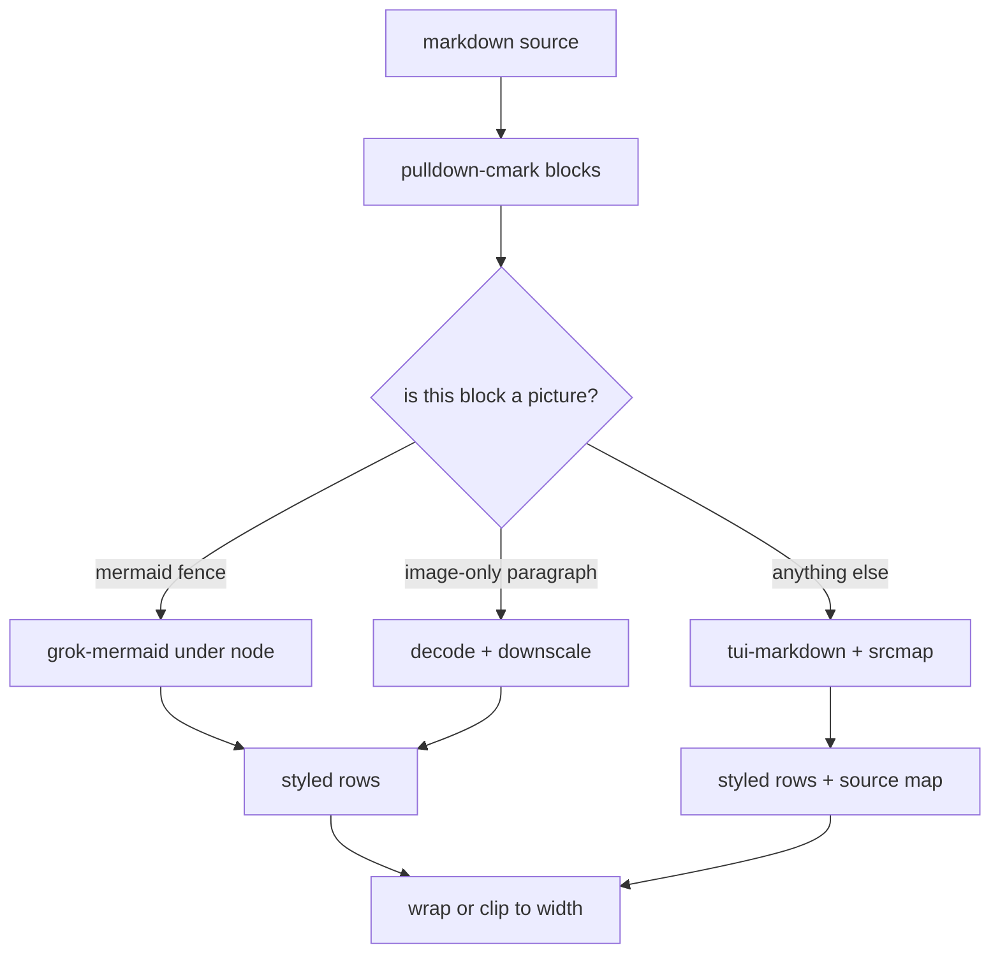
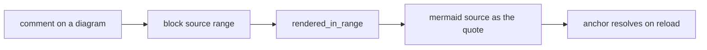
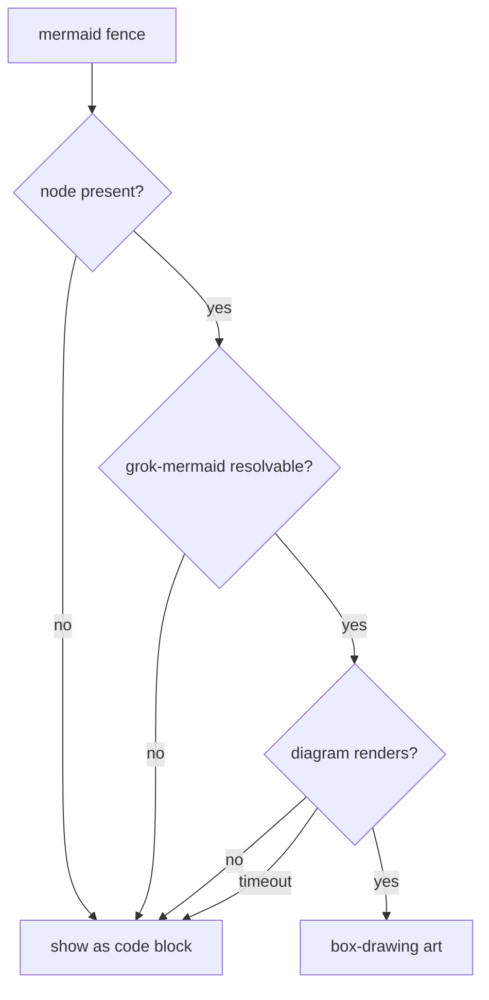

# Plan: diagrams and images as terminal art

Make `plannotator-tui` render a ```` ```mermaid ```` fence as box-drawing art and an image as an
actual picture, instead of showing both as literal text. Keep the review model intact: whatever
appears on screen must still be annotatable, and feedback sent to an agent must still name what
the human meant.

## Why now

Plans written for coding agents are full of diagrams. Today a reviewer reading a plan in the
terminal sees `graph TD / A[Start] --> B{Choice}` as raw source and an image as `[img] banner`.
The one document type this tool exists to review is the one it renders worst.

## The seam

Every block already flows through one function that turns source into styled lines. Art is a
branch at that seam, not a new pipeline.



## Decision 1: cells, not pixels

| Approach | Scrolls / clips | Snapshot-testable | Terminal support | Verdict |
|---|---|---|---|---|
| Kitty / sixel graphics | no, escapes are absolute | no | negotiated, partial | rejected |
| Unicode half-blocks | yes, they are cells | yes | any truecolor | chosen |

The whole app is a grid of styled cells. Selection, scrolling, clipping, `--snapshot` and every
`TestBackend` assertion operate on cells. A raster image needs out-of-band escapes placed at
absolute positions, which the buffer diff knows nothing about and which scroll wrong the moment
the document moves.

With two pixels per cell each sub-pixel is square, so fitting to `cols × 2·rows` preserves the
aspect ratio with no correction factor.

## Decision 2: art stands for its block

A rendered character normally maps back to a source byte, which is what makes a selection
quotable. Box-drawing is not the author's text, so art carries no per-cell offsets.

This has a consequence that is easy to miss and must be handled explicitly: a block-level
comment still has to store a quote the anchor can resolve. Art must therefore return the
*source* it stands for — the mermaid source, or the `` line — where a naive
implementation would return the empty string and write an annotation with no `originalText`.



## Decision 3: the node dependency must never fail a document

`grok-mermaid` is the only Mermaid-to-terminal engine worth using and it is JavaScript, so the
binary shells out to node with an embedded bridge script. That is the one runtime dependency
outside the binary, so every failure path collapses to the same harmless outcome.



A missing renderer must be learned once per process, not once per fence, or a machine without
node pays a failed spawn for every diagram in the document.

## Performance budget

Node startup is roughly 65 ms and dwarfs the cost of laying out a diagram, so per-fence spawning
is not acceptable. One process renders every diagram in the document.

| Case | Budget |
|---|---|
| 20 diagrams, renderer present | under 150 ms, measured with `--bench` |
| 20 diagrams, no node installed | one spawn total |
| Resize with an image on screen | no re-decode; re-sample a cached thumbnail |
| `big.md` (2.5 MB, no art) | unchanged from today |

## Work plan

1. `src/art/` — detection through `pulldown-cmark` only: the fence's info string and the image
   destination. Never string-match on markup.
2. `art/image.rs` — decode once into a bounded thumbnail, half-block conversion, alpha to
   terminal background.
3. `art/mermaid.rs` + embedded `.mjs` — batched request, bounded timeout, distinguish "renderer
   unusable" from "this diagram did not render".
4. `layout.rs` — one whole-document art pass; art skips wrapping and quotes its source.
5. `config.rs` — `[mermaid]` and `[image]` sections, env overrides, `~` expansion.
6. Docs: README, crate README measurements, decisions record.

## Test plan

One test per invariant, no mocks of our own types:

- an image paragraph becomes art whose cells map to no source byte
- art quotes the source it stands for rather than nothing
- a narrower width re-samples the image instead of clipping it
- remote and `data:` URLs are never read from disk
- fit keeps aspect ratio and never upscales
- two pixel rows make one cell with top as foreground
- transparent pixels show the terminal background
- an unknown style class keeps its text
- a mermaid info string is case-insensitive and may carry extra words
- only a paragraph that is *just* an image becomes art

Tests must not depend on node or on the developer's config, so art is disabled in the app's
test fixtures.

## Risks

- **Truecolor assumption.** A 256-color terminal will show a degraded picture. Accepted;
  documented.
- **Diagram-heavy documents still pay one node startup.** Accepted at ~65 ms once.
- **Selection inside a picture is impossible.** Intended, but must be documented as a limit so
  it does not read as a bug.
- **A malicious image could try to exhaust memory.** Bounded by decode limits and a file-size
  cap.

## Out of scope

Inline images inside lists and tables, remote image fetching, and a PR upstream.
